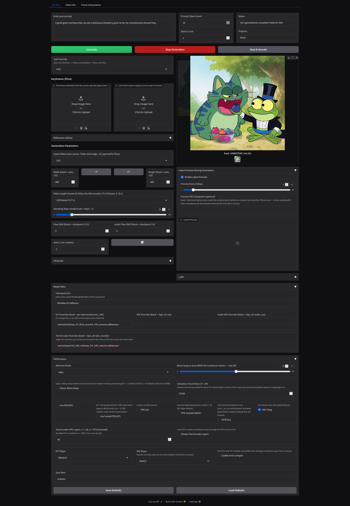

# h3 — MiniMax-H3 Video Generation GUI

A standalone Gradio interface for [MiniMax-H3](https://huggingface.co/MiniMaxAI/MiniMax-H3) video+audio generation, extracted from the H1111 project. Three tabs:

- **MiniMax** — text-to-video+audio (`t2va`), first/last-frame (`fl2va`), and reference-driven (`ref2va`) generation with a persistent background job queue, latent previews, LoRA support, fp8/int8 quantization, and block swap for consumer GPUs.
- **Frame Interpolation** — GIMM-VFI / BiM-VFI frame interpolation plus ESRGAN / SwinIR / BasicVSR++ upscaling and motion blur. Checkpoints auto-download on first use.
- **Video Info** — reads the generation parameters embedded in any video produced by this app and sends them back to the MiniMax tab to reproduce or iterate on a run.



## Installation

### Option A: uv (recommended)

With [uv](https://docs.astral.sh/uv/) installed, there is no setup step — the first run resolves and installs everything from `pyproject.toml` (torch comes from the cu128 PyTorch index) into a local `.venv`:

```bash
uv run h3.py
```

Optional ESRGAN/SwinIR upscaler support: `uv sync --extra upscalers`.

### Option B: venv + pip

```bash
python -m venv env
source env/bin/activate        # Windows: env\Scripts\activate
pip install torch torchvision torchaudio --index-url https://download.pytorch.org/whl/cu128   # match your CUDA
pip install -r requirements.txt
```

Install torch, torchvision, and torchaudio **together** in the first step so pip picks one matched set from the CUDA index. `requirements.txt` only sets minimum versions for them, so a torch stack you already have installed is respected and left untouched.

`ffmpeg` and `ffprobe` must be on your PATH (metadata embedding and the Video Info tab use them). Optional performance extras: `flash-attn`, `sageattention`, `xformers` (selectable as Attention Mode in the UI), and `spandrel` for the ESRGAN/SwinIR upscalers.

## Downloading the MiniMax-H3 model

The engine loads a **diffusers-layout** checkpoint directory. You download the original MiniMax release and convert it once with the included script.

### 1. Download the original release

The release lives at **https://huggingface.co/MiniMaxAI/MiniMax-H3** and contains two model partitions plus the shared Qwen3-VL-32B conditioner:

- `FL2VA/` — text-to-video+audio and first/last-frame tasks
- `Ref2VA/` — reference image/video/audio-driven task
- each partition carries `transformer/`, `vae/`, `audio_vae/`, `scheduler/`, and the shared `text_encoder/`, `tokenizer/`, `processor/` (Qwen3-VL)

```bash
huggingface-cli download MiniMaxAI/MiniMax-H3 --local-dir /path/to/MiniMax-H3
```

This is a large download (the DiT is 33B parameters ≈ 62 GB bf16 per partition, and the Qwen3-VL-32B text encoder is ~63 GB) — plan for several hundred GB of free disk across download + conversion.

### 2. Convert to the diffusers layout

One-shot conversion of both partitions (lossless — key renames and QKV de-interleave only, dtypes untouched):

```bash
minimax_engine/convert_minimax_h3.sh /path/to/MiniMax-H3 /path/to/MiniMax-H3-diffusers
```

- Needs **~135 GB free** at the output path.
- The Qwen3-VL components are **symlinked** from the source by default. Add `--copy-shared` (+~63 GB) if the output dir will be moved to another filesystem afterwards.
- The script uses `env/bin/python` from this repo if present, otherwise `python3`; override with `PYTHON=/path/to/python minimax_engine/convert_minimax_h3.sh ...` — with uv, use `PYTHON=.venv/bin/python` (run `uv sync` once first).
- It finishes with a self-verification step and prints the directory to point the GUI at.

Resulting layout:

```
MiniMax-H3-diffusers/
├── transformer/        (FL2VA — used by t2va and fl2va)
├── transformer_ref/    (Ref2VA — used by ref2va)
├── vae/  audio_vae/    (shared, with the release's real latents_mean/std)
├── scheduler/  audio_scheduler/
└── text_encoder/  tokenizer/  processor/   (stock Qwen3-VL, symlinked or copied)
```

The conversion is based on the upstream diffusers script from [huggingface/diffusers#14355](https://github.com/huggingface/diffusers/pull/14355) (vendored in `minimax_engine/_convert_minimax_h3_upstream.py`; `minimax_engine/convert_checkpoint.py` is the runnable wrapper). To convert a single partition manually:

```bash
# FL2VA: transformer + VAEs + schedulers
python minimax_engine/convert_checkpoint.py \
    --checkpoint_path /path/to/MiniMax-H3/FL2VA \
    --output_path /path/to/MiniMax-H3-diffusers

# Ref2VA: transformer only, then move it in as transformer_ref/
python minimax_engine/convert_checkpoint.py \
    --checkpoint_path /path/to/MiniMax-H3/Ref2VA \
    --output_path /tmp/ref_out --transformer_only
mv /tmp/ref_out/transformer /path/to/MiniMax-H3-diffusers/transformer_ref
```

Add `--dry_run` to either command to check the key mapping without writing anything.

### 3. Point the GUI at it

In the MiniMax tab, set **Checkpoint Dir** to `/path/to/MiniMax-H3-diffusers` (or pass `--ckpt_dir` when running `minimax_engine/minimax_generate_video.py` directly). Only the transformer partition the selected task needs is ever loaded.

### Optional: single-file overrides

The **DiT Override** and **Text Encoder Override** fields accept single-file exports instead of the checkpoint-dir components — including int8 "convrot" quantized exports (auto-detected; enable **INT8 Fast** to run them through `torch._int_mm`). The `ultra_p` style text-encoder export also carries the vision tower needed for `ref2va` image/video references.

## VRAM guidance

- Full-quality bf16 DiT: **61.7 GB** — needs Blocks to Swap on 48 GB cards.
- **Use Scaled FP8 (DiT)**: ~31 GB resident (lossy runtime quantization). `FP8 exclude AdaLN` trades +~13 GB for higher fidelity.
- **Blocks to Swap** (0–49) streams transformer blocks between CPU and GPU.
- **Text Encoder GPU Layers** / streaming control how much of the ~30B conditioner sits on the GPU; **Prompt Cache** skips the conditioner load entirely on repeat runs with identical inputs.

## Latent previews

The MiniMax tab can show in-progress previews every N steps. Blank **Preview TAE Checkpoint** = fast latent2rgb previews. For full-resolution TAE previews, enter a path like `weights/taeh3.safetensors` — known [madebyollin/taehv](https://github.com/madebyollin/taehv) checkpoints are downloaded automatically if the file is missing.

## Frame interpolation weights

Nothing to set up: checkpoints (GIMM-VFI variants, BiM-VFI, RAFT/FlowFormer aux, RealESRGAN, SwinIR, BasicVSR++) download automatically from [maybleMyers/interpolate](https://huggingface.co/maybleMyers/interpolate) into `weights/` on first use.

## Running

```bash
uv run h3.py          # uv
# or, with an activated venv:
python h3.py
```

Open http://localhost:7860. Generations run through a persistent file-based job queue (`wan_job_queue.json`) processed by a background worker — queued jobs survive browser disconnects and are executed sequentially. Outputs land in `outputs/` with the full generation parameters embedded in the mp4 metadata, which is what the Video Info tab reads back.

## Repository layout

```
h3.py                     the GUI (MiniMax / Frame Interpolation / Video Info)
minimax_engine/
├── minimax_generate_video.py    generation entry point (CLI, run per-job by the worker)
├── minimax_video/               model, pipeline, schedulers, quantization
├── convert_minimax_h3.sh        one-shot release → diffusers-layout conversion
├── convert_checkpoint.py        per-partition conversion wrapper
├── wan_job_queue.py / wan_worker.py    persistent job queue + background worker
├── interpolate_video.py / upscale_video.py / basicvsr_pp.py    interpolation backend
├── GIMM-VFI/                    interpolation model code
└── utils/ modules/ blissful_tuner/     shared engine infrastructure
ui_configs/               saved UI defaults (per-tab Save/Load Defaults buttons)
lora/                     drop LoRA .safetensors here (LoRA Folder field)
weights/                  auto-downloaded interpolation/upscale checkpoints
outputs/                  generated videos
```
